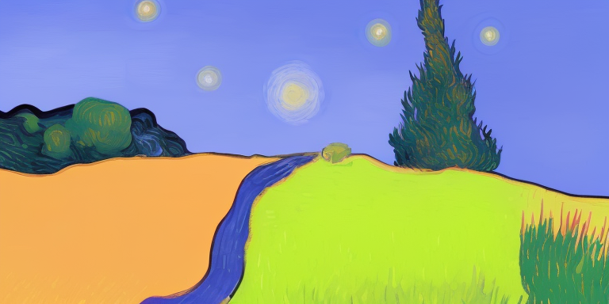

# Image2VanGogh

[](https://replicate.com/ovshake/replicate-ghibli-vangogh)

> The code is running on CPU, so it will be extremly slow. It takes ~7 minutes for 50 inference steps on replicate.com. You can use GPU to speed up the process. The script supports both.

This Python script allows you to generate images using the Ghibli-Diffusion model trained with PyTorch. The generated images are based on an input image and a text prompt, and the output is a transformed version of the initial image guided by the provided text prompt.


## Image Transformation Example

Here is an example of how this model transforms an input image based on a text prompt.

The original image:


The transformed image with the prompt "A van gogh painting of a starry night":



As you can see, the transformed image retains the basic structure of the original image but modifies the colors and details to match the style suggested by the text prompt.
## Installation

Ensure that you have Python 3.11 installed. You can download it from the official Python website if necessary.

Next, you need to install the necessary dependencies. Clone the repository and navigate to its directory. Then, use pip to install the requirements from the provided `requirements.txt` file:

```bash
git clone https://github.com/ovshake/replicate-img2img
cd replicate-img2img
pip install -r requirements.txt
```

## Usage

Once you have installed all the necessary dependencies, you can run the script using the following command:

```bash
python generate_image.py
```

The script requires an image file and a text prompt as input. The image file can either be a local file or a URL. If you use a URL, the script will download the image before processing it.

The `initialize_pipeline` function initializes the Ghibli-Diffusion model pipeline from a pretrained model. You can specify the model and the device (CPU or GPU) to use.

The `generate_image` function takes in the initialized pipeline, the image file path or URL, and the text prompt. It generates a new image based on the input image and the text prompt. You can optionally specify the strength, guidance scale, and seed for the generation process.

The main section of the script initializes the pipeline and generates a new image using an example input image and text prompt. The generated image is saved as a `.png` file.

## Note

This script assumes that you have a GPU available for use. If you do not have a GPU, you can modify the `device` parameter to `"cpu"` in both the `initialize_pipeline` and `generate_image` function calls.

## Example

This is an example of how you can use the script to generate a new image:

```python
device = "cuda" if torch.cuda.is_available() else "cpu"
pipe = initialize_pipeline(pipeline_model="nitrosocke/Ghibli-Diffusion", device=device)
image = generate_image(pipe, device=device, url_or_filepath="assets/sketch-mountains-input.jpg", prompt="A van gogh painting of a starry night.")
image.save("assets/output.png")
```

This code generates a new image based on the `sketch-mountains-input.jpg` image and the text prompt "A van gogh painting of a starry night". The generated image is saved as `output.png` in the `assets` directory.

## Replicate.com

This model is also available on replicate.com. You can access the model and run predictions using the web interface. You do not need to install any dependencies or write any code to use the model on replicate.com. Simply upload your image, enter your text prompt, and run the model to generate a new image.

Access the model on replicate.com at the following URL: [https://replicate.com/ovshake/replicate-ghibli-vangogh](https://replicate.com/ovshake/replicate-ghibli-vangogh)

To build this model, you can use `cog.yaml` config file. You can use replicate to run prediction using
```bash
cog predict -i image=@assets/sketch-mountains-input.jpg -i prompt="A van gogh painting"
```
You can also use `curl` to use the endpoint as an API.
```bash
(sd) ➜  replicate-img2img git:(main) curl -s -X POST \
  -d '{"version": "d991ed58d1254817879017e676da96d1c2c99976cac210395d14b17e1fb2b496", "input": {"image": "https://raw.githubusercontent.com/open-mmlab/mmdetection/main/resources/mmdet-logo.png", "prompt": "A van gogh style painting"}}' \
  -H "Authorization: Token $REPLICATE_API_TOKEN" \
  -H 'Content-Type: application/json' \
  "https://api.replicate.com/v1/predictions" | jq

```
and the output will look like this
```json
{
  "id": "ovbandjba7tcg2ffgi3hk2p2lm",
  "version": "d991ed58d1254817879017e676da96d1c2c99976cac210395d14b17e1fb2b496",
  "input": {
    "image": "https://raw.githubusercontent.com/open-mmlab/mmdetection/main/resources/mmdet-logo.png",
    "prompt": "A van gogh style painting"
  },
  "logs": "",
  "error": null,
  "status": "starting",
  "created_at": "2023-07-30T15:59:23.763416844Z",
  "urls": {
    "cancel": "https://api.replicate.com/v1/predictions/ovbandjba7tcg2ffgi3hk2p2lm/cancel",
    "get": "https://api.replicate.com/v1/predictions/ovbandjba7tcg2ffgi3hk2p2lm"
  }
}
```
Since this takes a long time, you need to keep polling to check when it completes. More details can be found [here](https://replicate.com/ovshake/replicate-ghibli-vangogh/api) on polling.
Docs on cog can be found [here](https://github.com/replicate/cog).
